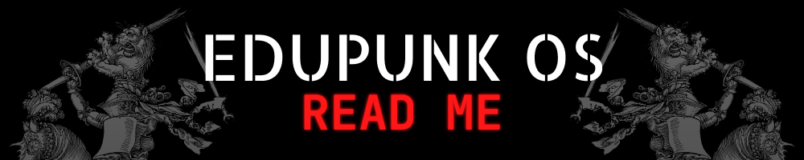
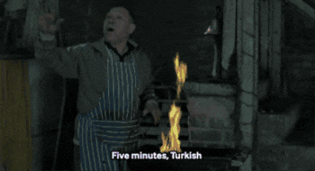

---

# PROJECT NAVIGATION

1. **[MANIFESTO](docs/main/MANIFESTO.md)** _— read about the foundation behind Edupunk OS and why **[@KHTHONDEV](https://github.com/khthondev)** is building it_
2. **[RESEARCH SQUAD](docs/research/RESEARCH.md)***
3. **[CONTRIBUTING MOSH PIT](docs/main/CONTRIBUTING.md)*** _— added EDUPUNK OS CONTRIBUTION GUIDELINES_
4. **[LEARN](docs/learn/LEARN.md)***
5. **[COMMUNITY](docs/main/COMMUNITY.md)***
6. **[STORIES](docs/stories/STORIES.md)***
7. **[ZERO-COST DEPLOYMENT](docs/deploy/ZERO-COST-DEPLOY.md)***
8. **[LEGAL STUFF](docs/main/LEGAL.md)***
9. **[ROADMAP](docs/main/ROADMAP.md)*** _— added ROADMAP_
10. **[CHANGELOG](docs/main/CHANGELOG.md)***

_*Pages 2–10 are under development:_

> _**[@KHTHONDEV:](https://github.com/khthondev)** I hope my cooking turns out well enough for the final product_

---

**THIS ISN'T JUST SOFTWARE. THIS IS EDUCATION RECLAIMED. THIS IS EDUPUNK OS**

**[github.com/khthondev/edupunk-os](https://github.com/khthondev/edupunk-os)**

> fork it / share it / make it better / guide to learn / learn to see >>>