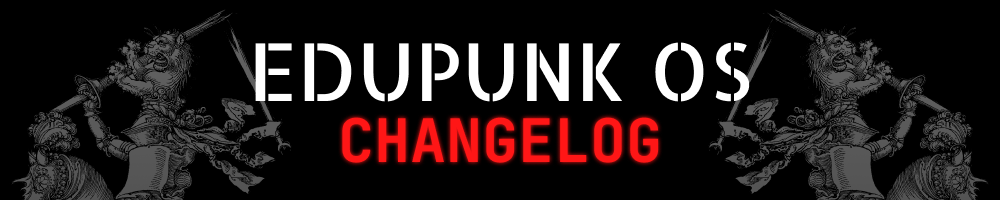

---

# 2025

## February

### 2025-02-25

- [x] _**[@KHTHONDEV](https://github.com/khthondev)** set up the project repo's initial structure, added mock pages, and the first version of the manifesto_

### 2025-02-27

- [x] _**[@KHTHONDEV](https://github.com/khthondev)** added labels to the repo to create product backlog later_

---

**THIS ISN'T JUST SOFTWARE. THIS IS EDUCATION RECLAIMED. THIS IS EDUPUNK OS**

**[github.com/khthondev/edupunk-os](https://github.com/khthondev/edupunk-os)**

> fork it / share it / make it better / guide to learn / learn to see >>>